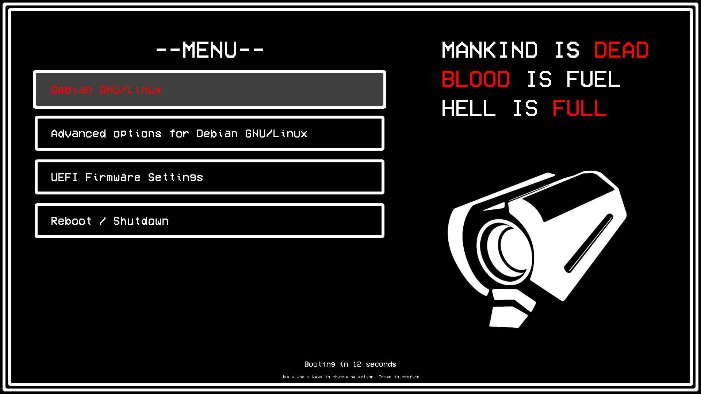

## ULTRAKILL GRUB theme

Supported languages: Chinese (simplified), Chinese (traditional), English, French, German, Hungarian, Italian, Korean, Latvian, Norwegian, Polish, Portuguese, Russian, Rusyn, Spanish, Turkish, Ukrainian




---


### Installation / update

- **Secure way:**

  - Download install script:

    ```sh
    wget -P /tmp https://github.com/YouStones/ultrakill-grub-theme/raw/main/install.sh
    ```

  - Review it at `/tmp/install.sh`

  - Run it:

    ```sh
    bash /tmp/install.sh
    ```

- **Easier, less secure way** — just download and run install script:

  ```sh
  wget -O - https://github.com/YouStones/ultrakill-grub-theme/raw/main/install.sh | bash
  ```

<br>

You can use `--lang` option to select language and disable interactive language selection, e.g.:

```sh
bash /tmp/install.sh --lang German
```

or

```sh
wget -O- https://github.com/Youstones/ultrakill-grub-theme/raw/main/install.sh | bash -s -- --lang Korean
```

<br>

Full list of languages see in `INSTALLER_LANGS` variable in [install.sh](install.sh)

---

### Uninstallation

- **Secure way:**

  - Download uninstall script:

    ```sh
    wget -P /tmp https://github.com/YouStones/ultrakill-grub-theme/raw/main/uninstall.sh
    ```

  - Review it at `/tmp/uninstall.sh`

  - Run it:

    ```sh
    bash /tmp/uninstall.sh
    ```

- **Easier, less secure way** — just download and run uninstall script:

  ```sh
  wget -O - https://github.com/YouStones/ultrakill-grub-theme/raw/main/uninstall.sh | bash
  ```

---

I used [this theme](https://github.com/shvchk/fallout-grub-theme) as a base

Copyright (c) 2017 Andrei Shevchuk
